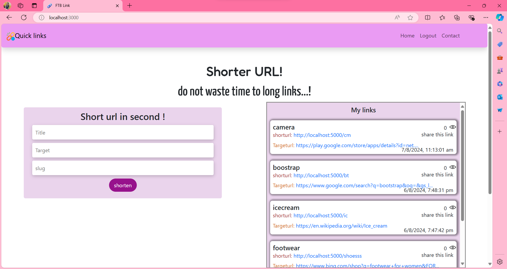

# Project-Name: FTB Links🔗
---
# Project-Title:  Quick Links

---
Welcome to FTB Link APP Project . 
** Quick Links** Shortened links are easier to share on social media, in text messages, or in any format where space is limited.

In a URL shortener project, the backend handles the creation, storage, and redirection of shortened links, while the frontend provides a user interface for generating and managing these links.

---
## Features
1. Converts long URLs into shorter, more manageable links
2.  Allows users to create custom, easy-to-remember short links
3.  Provides tracking data on link performance
4.  Supports custom domain names for branded short links
5.  Redirects users to the original URL when the short link is clicked.
---
### Home Page

## How to Contribute 💻

We welcome contributions from the community to help us expand and improve this handbook if you would like to contribute follow the steps:

1. Fork the repository to your GitHub account.
2. Make your changes ,add new content or fix the existing issues.
3. Open pull request in this repository.

---

## Contributors

Made with [contrib.rocks](https://contrib.rocks).